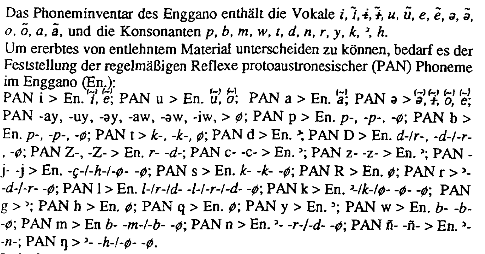

<!-- README.md is generated from README.Rmd. Please edit that file -->

```{r, include = FALSE}
knitr::opts_chunk$set(
  collapse = TRUE,
  echo = FALSE,
  comment = "#>"
)
```

# Overview

<!-- badges: start -->
[](https://doi.org/10.5281/zenodo.12754270) [](https://doi.org/10.17605/OSF.IO/FMG7C)
<!-- badges: end -->

Please cite this repository AND the original source [@nothofer1992] as follows:

> Rajeg, G. P. W. (2024, July 3). Tabular data of the Proto-Austronesian-to-Enggano sound changes derived from Nothofer (1992: 21). Retrieved from [https://doi.org/10.17605/OSF.IO/FMG7C](https://doi.org/10.17605/OSF.IO/FMG7C)

> Nothofer, Bernd. 1992. “Lehnwörter Im Enggano.” In Kölner Beiträge Aus Malaiologie Und Ethnologie Zu Ehren von Professor Dr. Irene Hilgers-Hesse, edited by F. Schulze and Kurt Tauchmann, 1:21–32. Kölner Südostasien Studien. Bonn: Holos.

This repository provides the [digitised, tabular version](https://github.com/engganolang/PAN-reflexes-in-Enggano-by-Nothofer/blob/main/Nothofer_1992_21_reg-sound-reflex-of-PAN-in-ENO.tsv) of the regular sound changes from Proto-Austronesian into Enggano presented in linear order in Nothofer [-@nothofer1992, 21], the original of which is shown below.

```{r orig}

```


# Reference