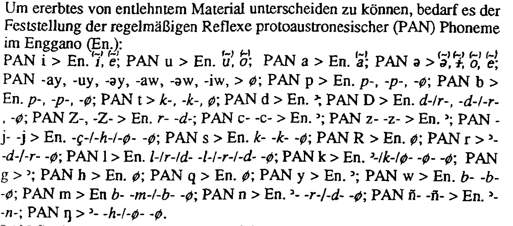

<!-- README.md is generated from README.Rmd. Please edit that file -->

# Overview

<!-- badges: start -->
<!-- badges: end -->

This repository provides the tabular version of the regular sound
changes from Proto-Austronesian into Enggano presented in Nothofer
([1992, 21](#ref-nothofer1992)), the original of which can be seen
below.

<!-- -->

# Reference

Nothofer, Bernd. 1992. “Lehnwörter Im Enggano.” In *Kölner Beiträge Aus
Malaiologie Und Ethnologie Zu Ehren von Professor Dr. Irene
Hilgers-Hesse*, edited by F. Schulze and Kurt Tauchmann, 1:21–32. Kölner
Südostasien Studien. Bonn: Holos.

